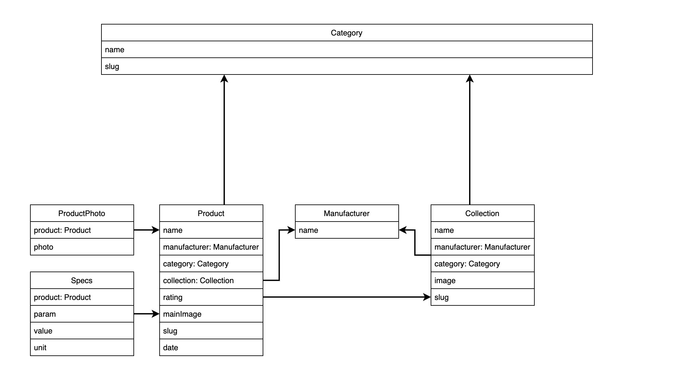

# Django Catalog

Implementing a product catalog in django

## About

This is a project for a chain of furniture stores. All fields and models were made according to the technical specifications of the customer. The model diagram looks like this:




## Running this project

To get this project up and running you should start by having Python installed on your computer. It's advised you create a virtual environment to store your projects dependencies separately. You can install virtualenv with

```
pip install virtualenv
```

Clone or download this repository and open it in your editor of choice. In a terminal (mac/linux) or windows terminal, run the following command in the base directory of this project

```
virtualenv env
```

That will create a new folder `env` in your project directory. Next activate it with this command on mac/linux:

```
source env/bin/active
```

Then install the project dependencies with

```
pip install -r requirements.txt
```


Now you can run the project with this command

```
python manage.py runserver
```

## Create postgresql db

### Mac Instructions

Instructions for Russian localization.\
Execute commands sequentially.

```
brew install postgres
brew services start postgresql

sudo psql -U *your_username* -d postgres

CREATE USER django_user WITH PASSWORD 'dbpass';
ALTER ROLE django_user SET client_encoding TO 'utf8';
CREATE DATABASE mebel_tut TEMPLATE=template0 ENCODING 'UTF-8' LC_COLLATE 'ru_RU.UTF-8' LC_CTYPE 'ru_RU.UTF-8';
GRANT ALL PRIVILEGES ON DATABASE mebel_tut TO django_user;
```

After that exit from pg and run this commands in root folder of project:

```
python manage.py makemigrations
python manage.py migrate
```

## Features:

<ol>
    <li>Automatic generation of folders for categories and products</li>
    <li>Auto-delete on photos and folders</li>
    <li>Slug auto-generation for RU-ru</li>
    <li>ORM and SEO optimization</li>
    <li>Api for telegram bot</li>
    <li>Auto Generated thumbnails</li>
    <li>Pagination</li>
    <li>Cache</li>
</ol>

#### And so on...

I hope that it will help with your e-commerce web sites or with simple catalogs like this
